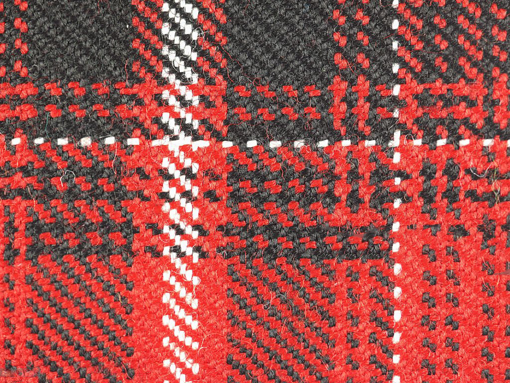

#  Color and Edge Analysis of Fabric using Python
This project shows how we can use Python to check the **colors** and **edges** in a fabric image. It uses OpenCV and Matplotlib to help understand the fabric structure and color.

---

## Files in This Project

- `IMAGE PROCESSING.ipynb` → The main notebook where all the code is
- `Tartan_fabric.png` → The fabric image used for analysis
- `README.md` → This file you're reading now

---

## Tools Used

- Python
- OpenCV (cv2)
- NumPy
- Matplotlib

---

## Steps Done in This Project

### 🔹 Step 1: Load Fabric Image  
- Loaded the fabric image  
- Changed its color from BGR - RGB to retain correct color

### 🔹 Step 2: Grayscale & Sharpening  
- Turned the image into grayscale (black and white)  
- Applied a sharpening filter to make the texture clearer

### 🔹 Step 3: RGB Histogram  
- Checked how much red, green, and blue is present  
- This helps in checking fabric dyeing or color issues

> ⚠️ This is a raw histogram with no post-processing

### 🔹 Step 4: Edge Detection (Canny Filter)  
- Found the edges in the fabric  
- Helpful for spotting threads, weave, or defects

---

## Fabric Image Used

Here is the fabric image I used:

---

## Why I Did This Project

This project is built to demonstrate practical image processing techniques in fabric inspection — useful for both research and real-world textile quality control.

---

## About Me

Made with grit, giggles, and grayscale by Sanjida Rahman

Fun Fact: This is my first real project and I am really excited to present it to the world!
